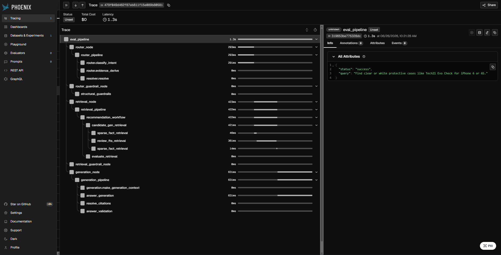

# Adaptive-Retail-RAG

A production-grade, signal-driven **Retrieval-Augmented Generation (RAG) pipeline** for answering product-related queries (lookups, comparisons, recommendations) over an Amazon Electronics dataset. Implements multi-strategy retrieval, LangGraph orchestration, query routing, semantic reranking, and full OpenTelemetry tracing.

Built to simulate a production-style RAG platform focused on multi-layered guardrails, robust entity grounding, context citation safety, and deep observability rather than standard naive prompt engineering.

**Focus:** End-to-end RAG lineage from raw review/product ingestion → hybrid vector search → stateful query orchestration → cited generation → validation.

---
## Demo Video

https://github.com/user-attachments/assets/0894868d-0d64-463a-b094-adc05f67b4fa

---
## System Guarantees

- Stateful and session-persisted multi-turn chat interactions with query rewriting
- LLM-based query validity, intent, and evidence classification guardrails
- Multi-strategy retrieval (Sparse FTS, Dense Vector, Hybrid RRF, Candidate Gen)
- Cross-encoder reranking for precise entity candidate resolution to database records
- Citations and validation checks for grounded generation answers
- Full OpenTelemetry observability and Arize Phoenix tracing

---

## Architecture Diagram



---

## Results 

### Pipeline Scale

| Metric | Value |
|---|---|
| Customer Reviews Ingested | 10M+ |
| Product Catalog Entries | 589,356 |
| Benchmark Queries | 140 |
| Vector Space Dimensions | 384 (Cosine Space) |
| Embedding Model | `BAAI/bge-small-en-v1.5` |
| Reranker Model | `cross-encoder/ms-marco-MiniLM-L-6-v2` |

### Retrieval & Generation Performance

#### Pipeline Latency 

| Stage / Metric | Mean | P50 (Median) | P95 | P99 |
|---|---|---|---|---|
| **Retrieval Latency** (Outliers Removed) | 56.3 ms | 59.0 ms | 135.0 ms | 175.6 ms |
| **Isolated Generation Latency** | 603.4 ms | 549.0 ms | 1,133.0 ms | 1,917.0 ms |
| **End-to-End RAG Latency** | 1.75 s | 1.24 s | 6.33 s | 9.17 s |

#### Generation Quality (LLM-as-a-Judge)

*Evaluated using `llama-3.3-70b-versatile` as the judge model.*

| Metric | Score (Mean) | Score Range |
|---|---|---|
| **Faithfulness** | 90.66% | 0.0% – 100.0% |
| **Answer Relevancy** | 80.43% | 33.0% – 95.0% |

The evaluation harness indicates robust performance, with exact match queries scoring high, and a generation pipeline maintaining an 80.43% average answer relevancy.

---

## Tech Stack

| Layer | Technologies |
|---|---|
| Orchestration & Graph | LangGraph, FastAPI, Uvicorn |
| Data Warehouse & Relational Store | PostgreSQL 17 (FTS, pg_trgm) |
| Vector Database | Qdrant |
| Embeddings & Reranking | SentenceTransformers (`BAAI/bge-small-en-v1.5`), CrossEncoder (`ms-marco-MiniLM-L-6-v2`) |
| Router, Rewrite & Generation LLMs | Groq API (`llama-3.1-8b-instant`, `llama-3.3-70b-versatile`) |
| Observability & Telemetry | OpenTelemetry, Arize Phoenix |
| Storage & Session | PostgreSQL, Python `shelve` |
| Client UI | Streamlit |
| Infrastructure | Docker, Docker Compose |

---

## Dataset 

This project uses the **Amazon Review Data (2018)** dataset curated by Jianmo Ni at UCSD, focusing on the **Cell Phones and Accessories** category.

[Amazon Review Data (2018) - Cell Phones and Accessories](https://nijianmo.github.io/amazon/index.html)

### Files
- **`meta_Cell_Phones_and_Accessories.json.gz`**: Raw compressed JSONL containing product profiles, metadata, categories, and attributes.
- **`Cell_Phones_and_Accessories.json.gz`**: Raw compressed JSONL containing product ratings, review text, help votes, and reviewer metadata.

---

## Key Features

- Production-style LangGraph state machine with typed state (`GraphState`) and conditional routing
- Signal-driven query understanding (validity checks, intent classification, evidence-type routing)
- Multi-strategy retrieval (PostgreSQL FTS sparse, Qdrant dense, Hybrid Reciprocal Rank Fusion, Candidate Gen)
- Entity grounding utilizing fuzzy trigram match, title match, FTS, and CrossEncoder reranking
- Structured context builder formatting retrieval output into citation-keyed prompt blocks (`[CTX_N]`)
- Citation resolution mapping generated citation references to specific ASINs and Review IDs
- Multi-stage guardrails (router, retrieval, generation validation checks) for safety and quality
- Full OpenTelemetry tracing exportable to Arize Phoenix for deep telemetry logging
- Standalone evaluation harness for Retrieval Latency, End-to-End Latency, Faithfulness, and Answer Relevancy benchmarking
- Dockerized multi-service topology for local development and execution

---

## Project Structure

```
Adaptive-Retail-RAG/
├── config/             # App-wide settings and telemetry instrumentation
├── contracts/          # Pydantic schemas (data contracts) between layers
├── eval/               # Evaluation harness and metrics computation
├── generation_layer/   # Prompt builder, LLM answer synthesis, validation
├── graph_layer/        # LangGraph StateGraph, nodes, and routing edges
├── ingestion_pipeline/ # Sharded JSONL ingestion and embeddings generator
├── orchestration/      # Coordinators integrating routing, retrieval, generation
├── retrieval_layer/    # Sparse, dense, fusion, and candidate retrievers
├── routing_layer/      # Intent classifiers, entity resolvers, and guardrails
├── sql/                # DDL tables and GIN indexing script
├── ui.py               # Streamlit application UI
├── main.py             # FastAPI REST endpoints
└── README.md
```
---

## LangGraph Orchestration Pipeline (`graph_layer/`)

### Node Execution Flow



#### The Node Execution Flow illustrates the high-level transitions and guardrail logic of the LangGraph state machine. It manages conditional routing to the Clarification node when validation rules or safety thresholds are triggered.

### Detailed Execution Flow



#### The LangGraph state machine manages typed states across nodes. Queries are rewritten using history, routed by intent/evidence, retrieved via multi-arm strategies, validated by guardrails, and generated with citations. Any structural or safety failure gracefully routes to the clarification node to return user-friendly error messages.

---

## Ingestion Pipeline (`ingestion_pipeline/`)

### Pipeline Flow



#### The Ingestion Pipeline ingests products and reviews from gzip JSONL shard datasets into PostgreSQL and Qdrant. A local tracker state table (`rag_ingest_state`) prevents duplicating shards, and un-vectorized reviews are embedded using SentenceTransformers and pushed to Qdrant.


---

## Metadata & Lineage Tracking

The system has native OpenTelemetry instrumentation capturing spans such as the main pipeline, intent classifier, candidate search, reranking, hybrid fusion retrieval, and answer validation. These spans are visualized in Arize Phoenix for tracing and debuggability.



---

## Running the Pipeline

### Prerequisites
- Docker & Docker Compose
- Python 3.11+
- Groq API Key (configured in `.env`)

### Quick Start

```bash
docker compose up -d
```

### Access Services

| Service | URL |
|---|---|
| FastAPI Backend | http://localhost:8000 |
| Streamlit Frontend UI | http://localhost:8501 |
| Arize Phoenix UI | http://localhost:6006 |
| Qdrant Dashboard | http://localhost:6333/dashboard |

### Trigger Ingestion & Evaluation

To run data ingestion and embedding generation:

```bash
python ingestion_pipeline/ingestion.py --run-date 2026-06-26 --starting-shard 0 --ending-shard 9 --metadata
python ingestion_pipeline/embeddings.py
```

To run retrieval and generation evaluation:

```bash
python eval/eval_run.py
python eval/generation_eval.py
```

---

## Future work and improvements

- **Dynamic Web Frontend**: Build a rich, interactive frontend interface (e.g., React or Next.js) to replace the basic Streamlit UI.
- **CI/CD Integration**: Implement GitHub Actions or similar automated pipelines for automated linting, checking, and unit testing.
- **Self-Healing Retrieval Loops**: Design LLM-driven retry and refinement loops that automatically adapt and heal weak retrieval bundles before passing them to generation.
- **PostgreSQL Session Persistence**: Transition session storage and chat history from local Python `shelve` file stubs to PostgreSQL for a production-ready setup.
